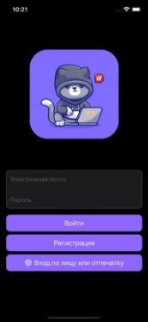
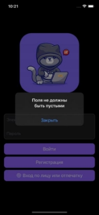
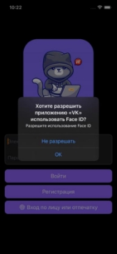
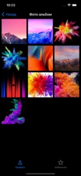
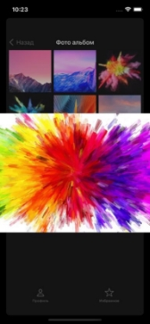

Дипломная работа — мобильное приложении для социальной сети ВКонтакте.

- Приложение написано на архитектуре MVC  
- Для работы с постами, добавлением и удалением их в избранном, используется Core Data
- Авторизация/регистрация пользователя происходит с помощью Firebase, а также UserDefaults и базы данных Realm
- Приложение полностью локализовано
- Есть поддержка светлой и темной темы

Приложение VK      

После запуска приложения пользователь попадает на экран авторизации, где может зарегистрироваться или войти, введя логин и пароль (хранятся в базе Firebase), а если ранее был авторизован, то может использовать FaceID/TouchID.

  

Приложение принимает светлую или темную тему в зависимости от настроек телефона, также есть поддержка русского и английского языка.

 

Если авторизация прошла успешно, пользователь попадает на главный экран с профилем, там он может устанавливать статус пользователя, проматывать ленту постов и добавлять понравившийся пост в избранное путем двойного нажатия на сам пост. Также пост можно удалить из избранного свайпом влево. В профиле пользователя есть кнопка выхода, которая разлогинивает пользователя.  

 

Также можно зайти в фотоальбом пользователя нажатием на ячейку с изображениями, на этом экране можно открыть любое изображение.

 
